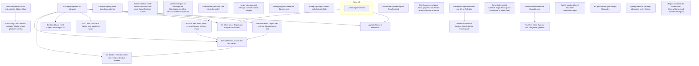

# Graph: depends_on

Directed graph of items connected through `depends_on`, nested by `parent`. An arrow from A to B means B is in A's `depends_on`.

```mermaid
flowchart TD
    ai-opponents-too-weak["AI-Gegner spielen zu schwach"]
    bot-game-diagnosis["Man sieht nicht, warum ein Bot verliert"]
    bot-strength-measurement["Die Stärke eines Bots lässt sich nicht verlässlich messen"]
    client-possible-orders["Ein Client kann nicht fragen, was möglich ist"]
    client-what-if["Ein Client kann nicht fragen, was passieren würde"]
    combat-forecast-core["Kampfausgang vorab berechnen können"]
    dotnet-upgrade-and-union-types["Auf die nächste .NET-Version wechseln und neue Sprachfeatures nutzen"]
    engine-rules-for-clients["Ein Client muss Regeln der Engine nachbauen"]
    flat-pending-queues["Warteschlangen für Trainings und Konstruktionen ohne verschachtelte Dictionaries"]
    game-persistence["Spielstände speichern und wiederherstellen"]
    map-generator-and-default-settings["Karten erzeugen und Settings nicht sechsfach pflegen"]
    movement-range["Bewegungsreichweite pro Einheitentyp"]
    occupancy-rules-in-one-place["Belegungsregeln stehen mehrfach im Code"]
    opponent-estimate["Ein Bot weiß nicht, womit er beim Gegner rechnen muss"]
    pending-only-queues["Warteschlangen enthalten nur offene Aufträge"]
    player-knowledge-in-state["Wissen der Spieler liegt im Regelzustand"]
    reconnaissance["Die Zusammensetzung einer gegnerischen Armee erfährt man nur im Kampf"]
    research-cost-and-duration["Forschung kostet nichts und nutzt die falsche Stufe"]
    research-level-validation["Forschung kann über die Upgrade-Tabelle hinaus gestartet werden"]
    split-game-state["GameState vereint Zustand, Zugauflösung und Validierung in einer Datei"]
    state-evaluation["Niemand kann sagen, wer in einem Zustand vorne liegt"]
    training-cancellation-after-completion["Zerstörte Gebäude brechen bereits fertige Trainings ab"]
    turn-report["Nachvollziehbarkeit der Zugauflösung"]
    turn-result["NextTurn liefert Zustand und Ereignisse getrennt"]
    subgraph ui ["Neue UI"]
        ui-concept["UI-Konzept erarbeiten"]
    end
    upgrade-concept["Upgrade-Konzept erarbeiten"]
    upgrade-draft["Spieler starten alle mit denselben Voraussetzungen"]
    upgrade-variety["Es gibt nur drei gleichartige Upgrades"]
    upkeep["Upkeep steht im Konzept, aber nicht in der Engine"]
    validate-regression-tests["Regressionstests für Validate mit Warteschlangen auf anderen Hexagons"]
    ai-opponents-too-weak --> bot-game-diagnosis
    ai-opponents-too-weak --> bot-strength-measurement
    ai-opponents-too-weak --> client-possible-orders
    ai-opponents-too-weak --> client-what-if
    ai-opponents-too-weak --> engine-rules-for-clients
    ai-opponents-too-weak --> opponent-estimate
    ai-opponents-too-weak --> state-evaluation
    ai-opponents-too-weak --> upgrade-concept
    bot-game-diagnosis --> bot-strength-measurement
    opponent-estimate --> bot-game-diagnosis
    pending-only-queues --> training-cancellation-after-completion
    research-cost-and-duration --> research-level-validation
    state-evaluation --> bot-game-diagnosis
    turn-report --> turn-result
    ui --> engine-rules-for-clients
    ui --> upgrade-concept
```
